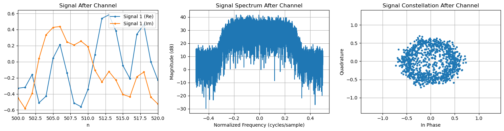
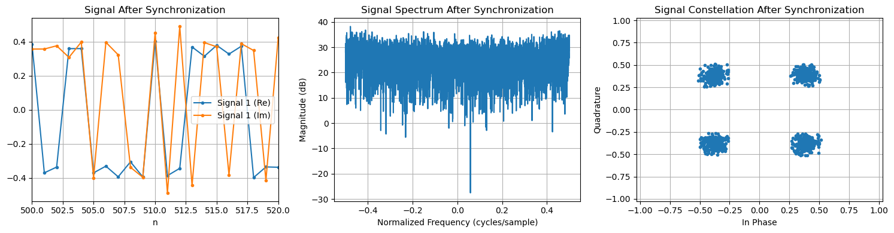

# SDR Notebooks & Libraries


> **Work In Progress**  
> This project is under active development. Core features are incomplete, and the implementation and interface are subject to change.




---

## Motivation

Modern digital communications and SDR (Software Defined Radio) systems are complex, requiring careful design, simulation, and optimization of algorithms for synchronization, channel estimation, equalization, and more.  
This repository was created to provide a flexible, research-oriented environment for:

- **Rapid prototyping:** Quickly develop and test new SDR algorithms in Python using Jupyter notebooks.
- **Performance and deployment:** Port validated algorithms to C++ for high-performance, real-time operation.
- **Education and research:** Serve as a learning tool and a platform for exploring advanced topics in digital communications.

The end goal is to implement robust QPSK and OFDM pipelines that can run in real time, transmitting on an ADALM-Pluto SDR and receiving on an RTL-SDR, with all core DSP algorithms developed and validated in this repository.

---

## Overview

This repository is a research and prototyping environment for modern digital communications and software-defined radio (SDR) algorithms.  
Algorithms are developed in Python, ported to C++, and ultimately deployed as custom GNU Radio blocks in other repositories for real-time pipelines.

- **Python prototyping workflow:** Develop and validate algorithms in Python (`notebooks/`, `py_utils/`).
- **C++ for performance:** Port algorithms to C++ (`cpp_utils/`) for real-time use.
- **GNU Radio integration:** Final C++ code will be packaged as custom blocks for live SDR pipelines.
- **Hardware targets:** Designed to be used with PlutoSDR (transmit) and RTL-SDR (receive).

---

## Project Structure

- `notebooks/` — Jupyter notebooks for algorithm exploration and simulation
- `py_utils/` — Python DSP/SDR library (prototyping and reference)
- `cpp_utils/` — C++ DSP/SDR library, unit tests, and Python bindings

### Featured notebook

Check out the completed QPSK demo notebook for a full end-to-end example:

- [notebooks/qpsk_sim.ipynb](./notebooks/qpsk_sim.ipynb)

---

## Related Repositories

- [qpsk-pluto2rtl-pipeline](https://github.com/cddelong6626/qpsk-pluto2rtl-pipeline)  
  Final QPSK pipeline, C++ algorithms, and custom GNU Radio blocks (WIP)

- [ofdm-pluto2rtl-pipeline](https://github.com/cddelong6626/ofdm-pluto2rtl-pipeline)  
  Final OFDM pipeline, C++ algorithms, and custom GNU Radio blocks (WIP)

---

## Setup Requirements

### System Packages

```sh
# Ubuntu/Debian example
sudo apt update
sudo apt install -y jupyter-notebook jupyter

# For KFR DSP library, follow instructions at https://www.kfrlib.com/docs/latest/installation/
# For pybind11 (for C++/Python bindings)
sudo apt install -y pybind11-dev
```

---

## Building C++ Code

```sh
cd cpp_utils
./run_build      # Build the C++ library and Python bindings
./run_tests      # Run unit tests
```

---

## Running Notebooks

```sh
cd notebooks
jupyter notebook
```

---

## See subproject README.md files for more details.