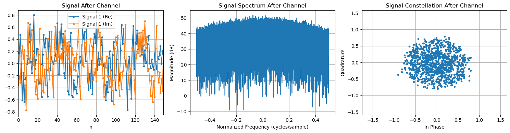
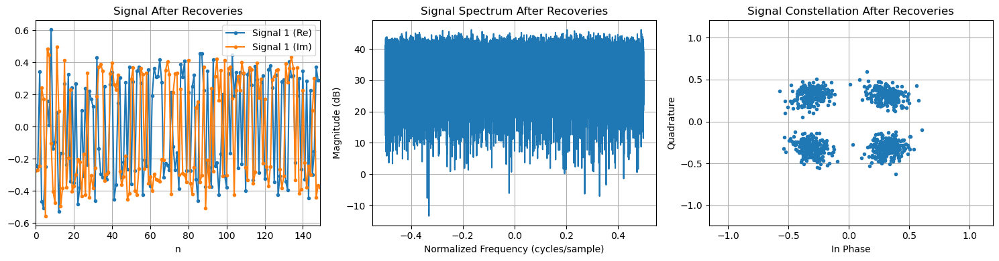

# py_utils — Python SDR/DSP Library

This module contains modular, pure-Python implementations of SDR and DSP algorithms for prototyping and validation.

---
## Purpose

- Rapid prototyping and validation
- Reference for C++ ports in `cpp_utils`

---

## Features

- Carrier and timing recovery (Costas, Gardner, Mueller-Muller, etc.)
- Channel models (fading, noise, multipath)
- Modulation/demodulation (QPSK, OFDM)
- Equalization, coding, metrics, visualization, and more

---

## Installation

Clone this repo and navigate to sdr-notebooks/py_utils. Install in editable mode:

```bash
cd py_utils
pip install -e .
```

---

## Usage

Once this project has been installed, it can be imported as `py_utils`. 

### End-to-End QPSK Example

See this full pipeline and its output in [notebooks/example.ipynb](../notebooks/example.ipynb).

#### Imports
```python
import py_utils as pu
import numpy as np
```


#### QPSK modulation
```python
N_BITS = 10**4
bits_tx = np.random.randint(2, size=N_BITS)
sym_tx = pu.modulation.modulate_qpsk(bits_tx)
```

#### Upsampling

```python
SPS = 2
sym_tx = pu.dsp.upsample(sym_tx, SPS)
```

#### RRC pulse filtering

```python
N_RRC_TAPS = SPS*10 + 1
sym_tx = pu.dsp.rrc_filter(sym_tx, N_RRC_TAPS, SPS)
```

#### Channel: CFO, STO, AWGN

```python
SNR_DB = 20     # dB SNR
CFO_PCT = 0.01  # 1% CFO
STO = 0.3       # fractional symbol offset

sig_chan = pu.channel.apply_cfo(sym_tx, CFO_PCT)
sig_chan = pu.channel.apply_sto(sig_chan, STO)
sig_chan = pu.channel.apply_awgn(sig_chan, SNR_DB)

sig_rx = sig_chan
```

#### Matched filtering

```python
sig_matched = pu.dsp.rrc_filter(sig_rx, N_RRC_TAPS, SPS)
```

#### Symbol timing recovery

```python
stc = pu.timing_recovery.GardnerSymbolTimingCorrector()
symbols_sampled = stc.correct_batch(sig_matched)
```

#### Carrier frequency recovery

```python
K_p = 0.04
K_i = 0.03
control = pu.PIDFeedback(K_p, K_i)

sym_rot = pu.carrier_recovery.costas_loop(symbols_sampled, control)
```

#### QPSK demodulation

```python
bits_rx = pu.modulation.demodulate_qpsk(symbols)
```

#### BER computation

```python
ber, n_err = pu.metrics.compute_er(bits_tx, bits_rx)
print(f'BER: {ber} ({n_err}/{N_BITS})')
```

#### Example: Plot signal before and after recoveries

```python
from py_utils import visualization as vz

vz.visualize(
    sig_rx, 
    plots=('time', 'frequency', 'constellation'), 
    plot_kwargs={
        'time': {'title': 'Signal After Channel', 'n_samps': 150}, 
        'frequency': {'title': 'Signal Spectrum After Channel'},
        'constellation': {'title': 'Signal Constellation After Channel'}
    }
);

vz.visualize(
    sym_rot, 
    plots=('time', 'frequency', 'constellation'), 
    plot_kwargs={
        'time': {'title': 'Signal After Recoveries', 'n_samps': 150}, 
        'frequency': {'title': 'Signal Spectrum After Recoveries'},
        'constellation': {'title': 'Signal Constellation After Recoveries'}
    }
);
```


Plots generated by this code:


